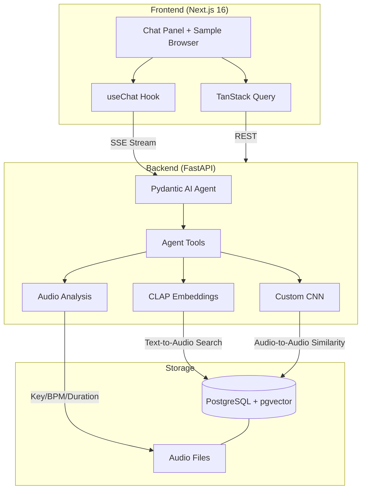

<div align="center">
  
  <h1>SampleSpace</h1>
  <p>An AI-powered music sample assistant that combines a custom PyTorch CNN for spectrogram similarity, CLAP embeddings for natural language audio search, and a Pydantic AI agent orchestrating both to answer queries like <em>"find a warm pad in D minor at 120 BPM."</em></p>

  [](https://github.com/LukeMainwaring/samplespace/actions/workflows/ci.yml)
</div>

<!-- TODO: demo GIF — see docs/ROADMAP.md -->

## Why SampleSpace?

Music producers spend hours browsing sample libraries by folder name and filename. SampleSpace makes your entire library searchable by description, sound, and musical context — then learns your taste from feedback to get better over time.

## Features

- **Natural language search** — CLAP text-to-audio embeddings let you search by description ("dark gritty kick", "airy vocal chop") via pgvector cosine similarity
- **Audio-to-audio similarity** — Custom-trained dual-head CNN (4 residual blocks, SE attention, SupCon + CE loss) finds spectrally similar samples via 128-dim embeddings
- **Agentic orchestration** — Pydantic AI agent decides which tools to call per query, enabling multi-step reasoning (analyze sample → check key compatibility → search for complement)
- **Song context** — Persistent per-thread key/BPM/genre/vibe that enriches searches and survives page refreshes
- **Pair feedback + preference learning** — Side-by-side sample evaluation with mixed audio preview, thumbs up/down verdicts, and a logistic regression that learns your pairing taste from 10-dimensional feature vectors
- **Kit builder** — Greedy pairwise optimization assembles multi-sample kits (kick + snare + hihat + bass + pad) with CLAP retrieval, compatibility scoring, and CNN diversity penalties
- **Sample upload** — Upload reference tracks with auto-detected key/BPM/loop classification, then find similar library samples via audio-to-audio search
- **Audio transforms** — Pitch-shift and time-stretch via Rubber Band R3 for "Play Together" mixed previews aligned to song context

## Demo Workflows

These prompts showcase what SampleSpace can do that browsing folders can't.

**Context-aware search:**
> "I'm making a dark techno track in D minor at 130 BPM — find me a warm pad"

Sets song context, then searches with CLAP embeddings enriched by the vibe. All subsequent searches inherit the context.

**Multi-step reasoning:**
> "Find a bass that goes well with this kick" *(after uploading a reference track)*

Agent analyzes the upload's key/BPM, finds CNN-similar library samples, filters by key compatibility, and ranks by CLAP relevance.

**Preference-driven pairing:**
> "Let's do a pairing session for loops"

Rapid-fire pair evaluation with random anchors. After 15+ verdicts, the preference model influences candidate selection and the agent explains what it's learned about your taste.

## Architecture



### Why CLAP + CNN + Agent?

- **CLAP** (pretrained): Bridges human language to audio content. "Warm analog pad" maps to the right spectral characteristics without any training.
- **CNN** (custom-trained): Learns spectral features specific to this sample library. Audio-to-audio similarity that CLAP can't do well.
- **Agent**: Orchestrates both modalities + metadata filtering. A query like _"find a lead that goes well with this bass"_ triggers CNN similarity, key compatibility filtering, then CLAP ranking.

## Quick Start

### Prerequisites

- [Docker](https://docs.docker.com/get-docker/) (for PostgreSQL + pgvector)
- [uv](https://docs.astral.sh/uv/) (Python package manager)
- [pnpm](https://pnpm.io/) (Node package manager)
- [Node.js](https://nodejs.org/) 20+
- [Rubber Band](https://breakfastquay.com/rubberband/) (`brew install rubberband` on macOS, `apt install rubberband-cli` on Linux)
- OpenAI API key

### Setup

```bash
# Clone and configure
git clone https://github.com/LukeMainwaring/samplespace.git
cd samplespace
cp .env.sample .env
# Edit .env with your OPENAI_API_KEY and SAMPLE_LIBRARY_DIR

# Start PostgreSQL + backend
docker compose up -d

# Backend setup
uv sync --directory backend
uv run --directory backend pre-commit install

# Seed and embed samples
uv run --directory backend seed-samples
uv run --directory backend embed-samples    # CLAP embeddings (~2 min)

# Train CNN (optional)
uv run --directory backend train-cnn
uv run --directory backend embed-cnn        # CNN embeddings (after training)

# Frontend setup
pnpm -C frontend install
pnpm -C frontend generate-client
pnpm -C frontend dev

# Visit http://localhost:3002
```

## Tech Stack

| Layer | Technology |
|-------|-----------|
| Frontend | Next.js 16, Tailwind CSS, shadcn/ui, TanStack Query |
| Chat UI | Vercel AI SDK (`useChat`), Streamdown |
| Backend | FastAPI, Pydantic v2, async SQLAlchemy |
| Agent | Pydantic AI with OpenAI |
| ML | PyTorch, torchaudio (CNN), HuggingFace transformers (CLAP), scikit-learn (preference model) |
| Embeddings | CLAP (`laion/clap-htsat-unfused`) 512-dim, Custom CNN 128-dim |
| Database | PostgreSQL + pgvector |
| Audio | librosa (key/BPM detection), music21, [Rubber Band](https://breakfastquay.com/rubberband/) R3 (pitch-shift/time-stretch) |
| DevOps | Docker Compose, GitHub Actions CI |
| Code Quality | Ruff, mypy (strict), pre-commit, Biome/Ultracite |

## Development

See [DEVELOPMENT.md](DEVELOPMENT.md) for testing, linting, migrations, and API client generation.

## Roadmap

See [docs/ROADMAP.md](docs/ROADMAP.md) for planned features including active learning, preference-aware recommendations, and confidence-gated automation.
