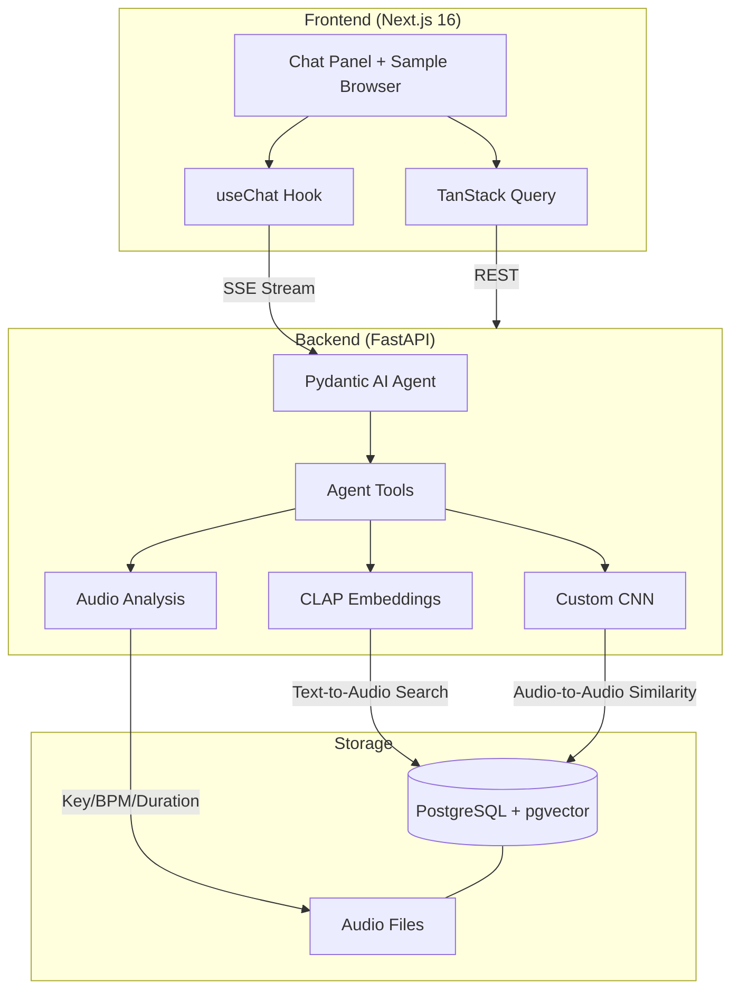

# SampleSpace

An AI-powered music sample assistant that combines a custom PyTorch CNN for spectrogram similarity, CLAP embeddings for natural language audio search, and a Pydantic AI agent orchestrating both to answer queries like _"find a warm pad in D minor at 120 BPM."_

## Architecture



### How It Works

1. **User asks a question** in the chat panel (e.g., _"find me a bright hi-hat"_)
2. **Pydantic AI agent** decides which tools to call based on the query
3. **CLAP search** encodes the text query into a 512-dim embedding, then finds nearest audio embeddings via pgvector cosine similarity
4. **CNN similarity** uses a custom-trained dual-head CNN to find spectrally similar samples via 128-dim embeddings
5. **Music theory tools** check key compatibility (circle of fifths) and suggest complementary samples
6. **Agent streams response** back as SSE in Vercel AI SDK format, with transparent tool-call display

### Why CLAP + CNN + Agent?

- **CLAP** (pretrained): Bridges human language to audio content. "Warm analog pad" maps to the right spectral characteristics without any training.
- **CNN** (custom-trained): Learns spectral features specific to this sample library. Audio-to-audio similarity that CLAP can't do well.
- **Agent**: Orchestrates both modalities + metadata filtering. A query like _"find a lead that goes well with this bass"_ triggers CNN similarity, key compatibility filtering, then CLAP ranking. This multi-tool orchestration is the agentic AI signal.

## Tech Stack

| Layer | Technology |
|-------|-----------|
| Frontend | Next.js 16, Tailwind CSS, shadcn/ui, TanStack Query |
| Chat UI | Vercel AI SDK (`useChat`), Streamdown |
| Backend | FastAPI, Pydantic v2, async SQLAlchemy |
| Agent | Pydantic AI with OpenAI |
| ML | PyTorch, torchaudio (CNN), HuggingFace transformers (CLAP) |
| Embeddings | CLAP (`laion/clap-htsat-unfused`) 512-dim, Custom CNN 128-dim |
| Database | PostgreSQL + pgvector |
| Audio Analysis | librosa (key/BPM detection), music21 |
| DevOps | Docker Compose, GitHub Actions CI |
| Code Quality | Ruff, mypy (strict), pre-commit, Biome/Ultracite |

## Project Structure

```
samplespace/
├── backend/
│   ├── src/samplespace/
│   │   ├── app.py                  # FastAPI app + lifespan (CLAP model loading)
│   │   ├── agents/
│   │   │   ├── sample_agent.py     # Pydantic AI agent + system prompt
│   │   │   ├── deps.py             # AgentDeps (db, CLAP, CNN)
│   │   │   └── tools/              # CLAP search, CNN similarity, music theory
│   │   ├── ml/
│   │   │   ├── model.py            # Dual-head CNN (classification + 128-dim embedding)
│   │   │   ├── dataset.py          # torchaudio mel spectrogram dataset
│   │   │   ├── train.py            # Training with augmentation
│   │   │   └── predict.py          # Inference wrapper
│   │   ├── services/
│   │   │   ├── embedding.py        # CLAP embed_audio() / embed_text()
│   │   │   ├── audio_analysis.py   # librosa key/BPM/duration extraction
│   │   │   └── sample.py           # CRUD + pgvector search
│   │   ├── routers/                # REST + SSE streaming endpoints
│   │   ├── models/                 # SQLAlchemy (Sample with pgvector columns)
│   │   └── migrations/             # Alembic
│   ├── scripts/                    # seed.py, embed_samples.py, embed_cnn.py
│   └── tests/
├── frontend/
│   ├── app/
│   │   ├── page.tsx                # Split layout: chat + sample browser
│   │   └── api/chat/route.ts       # Proxy to backend agent
│   ├── components/
│   │   ├── chat-panel.tsx          # useChat + streaming + tool transparency
│   │   ├── sample-browser.tsx      # Sample grid with filters + audio playback
│   │   └── tool-call.tsx           # Collapsible tool call display
│   └── api/generated/              # Auto-generated TypeScript client
├── data/
│   ├── samples/                    # Audio files (gitignored)
│   └── checkpoints/                # CNN model checkpoints (gitignored)
└── docker-compose.yml
```

## Setup

### Prerequisites

- [Docker](https://docs.docker.com/get-docker/) (for PostgreSQL + pgvector)
- [uv](https://docs.astral.sh/uv/) (Python package manager)
- [pnpm](https://pnpm.io/) (Node package manager)
- [Node.js](https://nodejs.org/) 20+
- OpenAI API key

### Quick Start

```bash
# Clone and configure
git clone https://github.com/your-username/samplespace.git
cd samplespace
cp .env.sample .env
# Edit .env with your OPENAI_API_KEY

# Start PostgreSQL
docker compose up -d

# Backend setup
cd backend
uv sync
uv run pre-commit install

# Seed samples (place .wav files in data/samples/ organized by type)
uv run python scripts/seed.py

# Generate embeddings
uv run python scripts/embed_samples.py    # CLAP embeddings (~2 min)
uv run python scripts/embed_cnn.py        # CNN embeddings (after training)

# Train CNN (optional — small dataset, pipeline is the point)
PYTHONPATH=src uv run python -m samplespace.ml.train

# Frontend setup
cd ../frontend
pnpm install
pnpm generate-client

# Run
# Terminal 1: docker compose up -d (if not already running)
# Terminal 2: cd frontend && pnpm dev
# Visit http://localhost:3002
```

## Design Decisions

- **One backend service, not three.** The ML models load in-process — a separate service adds complexity without demonstrating anything at this scale.
- **pgvector for both embedding types.** One database for structured data + vector search. No external vector DB needed.
- **CLAP model choice.** Switched from `larger_clap_music` to `clap-htsat-unfused` for better text-audio contrastive alignment.
- **CNN dataset size.** 75 samples across 11 classes will overfit — the architecture and pipeline matter more than benchmark results. NSynth (300K samples) would be the scaling path.
- **No auth.** Portfolio demo — Auth0/JWT would add friction without demonstrating new skills.
- **Agentic RAG over static pipeline.** The agent decides which tools to call per query, enabling multi-step reasoning (analyze sample → check key → search for complement).

## Audio Pipeline

```
Audio File (.wav)
    │
    ├── librosa ──→ Key (Krumhansl-Schmuckler) + BPM + Duration
    │
    ├── CLAP ──→ 512-dim embedding (shared text-audio space)
    │              Uses audio_model + audio_projection independently
    │
    └── CNN ──→ 128-dim embedding + category prediction
                 4 conv blocks → global avg pool → dual head
                 Trained on mel spectrograms (128 mel bins, 2s fixed length)
```
