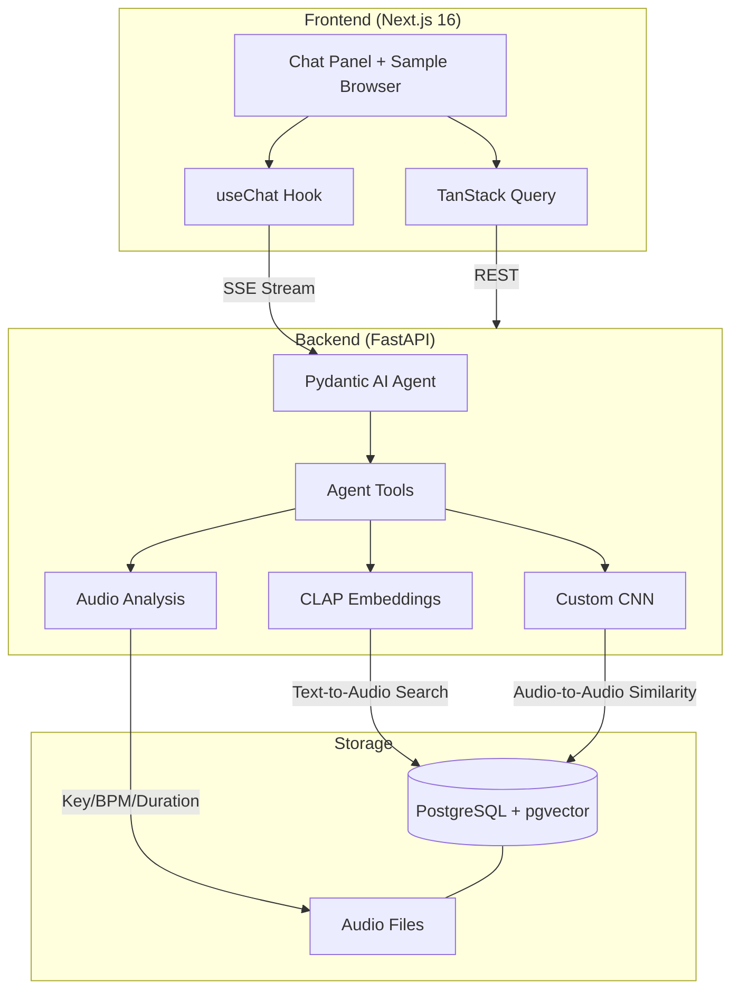

# SampleSpace

An AI-powered music sample assistant that combines a custom PyTorch CNN for spectrogram similarity, CLAP embeddings for natural language audio search, and a Pydantic AI agent orchestrating both to answer queries like _"find a warm pad in D minor at 120 BPM."_

## Architecture



### How It Works

1. **User asks a question** in the chat panel (e.g., _"I'm making a dark techno track in D minor at 130 BPM — find me a warm pad"_)
2. **Pydantic AI agent** detects song context and persists it to the thread (key, BPM, genre, vibe survive across messages and page refreshes)
3. **CLAP search** encodes the text query into a 512-dim embedding (enriched with song context vibe), then finds nearest audio embeddings via pgvector cosine similarity
4. **CNN similarity** uses a custom-trained dual-head CNN to find spectrally similar samples via 128-dim embeddings
5. **Music theory tools** check key compatibility (circle of fifths) and suggest complementary samples, using song context key/BPM as fallback defaults
6. **Sample upload** lets users upload WAV files (songs, snippets) as reference tracks. The system analyzes metadata, generates CLAP embeddings, and the agent finds similar library samples via audio-to-audio cosine similarity
7. **Pair feedback** lets users evaluate sample pairs — the agent presents plausible pairs with side-by-side playback and a "Play Together" mixed preview (aligned to song context key/BPM), collects thumbs up/down verdicts, and computes relational audio features in the background. Rapid pairing mode with random anchors and a "Next Pair" button enables fast verdict collection.
8. **Preference learning** trains a logistic regression on 10-dimensional feature vectors (4 pair scores + 6 relational audio features) from accumulated verdicts. Auto-retrains every 5th verdict after 15 verdicts. Learned preferences are injected into the agent's system prompt and surfaced via the `show_preferences` tool as natural-language explanations.
9. **Kit builder** assembles a complete multi-sample kit (e.g., kick + snare + hihat + bass + pad) using a greedy algorithm that maximizes pairwise compatibility. Per-type CLAP search retrieves candidates, fast inline scoring selects samples, and CNN diversity penalties prevent spectral redundancy — all rendered as an interactive kit card with per-slot playback
10. **Agent streams response** back as SSE in Vercel AI SDK format, with transparent tool-call display and a song context badge in the chat header

### Why CLAP + CNN + Agent?

- **CLAP** (pretrained): Bridges human language to audio content. "Warm analog pad" maps to the right spectral characteristics without any training.
- **CNN** (custom-trained): Learns spectral features specific to this sample library. Audio-to-audio similarity that CLAP can't do well.
- **Agent**: Orchestrates both modalities + metadata filtering. A query like _"find a lead that goes well with this bass"_ triggers CNN similarity, key compatibility filtering, then CLAP ranking. This multi-tool orchestration is the agentic AI signal.

## Tech Stack

| Layer | Technology |
|-------|-----------|
| Frontend | Next.js 16, Tailwind CSS, shadcn/ui, TanStack Query |
| Chat UI | Vercel AI SDK (`useChat`), Streamdown |
| Backend | FastAPI, Pydantic v2, async SQLAlchemy |
| Agent | Pydantic AI with OpenAI |
| ML | PyTorch, torchaudio (CNN), HuggingFace transformers (CLAP), scikit-learn (preference model) |
| Embeddings | CLAP (`laion/clap-htsat-unfused`) 512-dim, Custom CNN 128-dim |
| Database | PostgreSQL + pgvector |
| Audio Analysis | librosa (key/BPM detection), music21 |
| DevOps | Docker Compose, GitHub Actions CI |
| Code Quality | Ruff, mypy (strict), pre-commit, Biome/Ultracite |

## Project Structure

```
samplespace/
├── backend/
│   ├── src/samplespace/
│   │   ├── app.py                  # FastAPI app + lifespan (CLAP + CNN model loading)
│   │   ├── agents/
│   │   │   ├── sample_agent.py     # Pydantic AI agent + system prompt + dynamic context/rules
│   │   │   ├── deps.py             # AgentDeps (db, CLAP, CNN, song context)
│   │   │   └── tools/              # CLAP, CNN, analysis, context, pairs, transform, upload, verdicts, kit, preferences
│   │   ├── ml/
│   │   │   ├── model.py            # Dual-head CNN (512-ch backbone + 2-layer projection → 128-dim embedding)
│   │   │   ├── dataset.py          # torchaudio mel spectrogram dataset with augmentation
│   │   │   ├── train.py            # Training (SupCon + CE, cosine annealing, AMP, TensorBoard)
│   │   │   └── predict.py          # Inference wrapper
│   │   ├── services/
│   │   │   ├── embedding.py        # CLAP embed_audio() / embed_text()
│   │   │   ├── audio_analysis.py   # librosa key/BPM/duration extraction
│   │   │   ├── sample.py           # CRUD + pgvector search
│   │   │   ├── pair_features.py    # Relational audio features for sample pairs (6 librosa metrics)
│   │   │   ├── preference.py       # Preference model training, prediction, and explainability
│   │   │   ├── candidate_search.py # Shared CLAP query building + context-aware reranking
│   │   │   ├── kit_builder.py      # Greedy kit assembly (CLAP retrieval + pairwise optimization)
│   │   │   ├── spectrogram.py      # Mel spectrogram PNG generation with disk caching (full + CNN view)
│   │   │   └── upload.py           # WAV upload pipeline (validate, store, analyze, embed)
│   │   ├── routers/                # REST + SSE streaming endpoints
│   │   ├── models/                 # SQLAlchemy (Sample, Thread, PairVerdict)
│   │   └── migrations/             # Alembic
│   ├── scripts/                    # Shell scripts (migrations, Docker helpers)
│   └── tests/
├── frontend/
│   ├── app/
│   │   ├── page.tsx                # Split layout: chat + sample browser
│   │   └── api/chat/route.ts       # Proxy to backend agent
│   ├── components/
│   │   ├── chat.tsx                # Chat orchestrator (useChat + song context + upload + verdict actions)
│   │   ├── messages.tsx            # Message list with smart scroll
│   │   ├── message.tsx             # Message rendering + RiffingMessage loading state
│   │   ├── multimodal-input.tsx    # Chat input with file attachment + local storage persistence
│   │   ├── greeting.tsx            # Animated empty state
│   │   ├── song-context-badge.tsx  # Read-only song context display (key/BPM/genre/vibe)
│   │   ├── sample-browser.tsx      # Sample grid with filters; split-pane layout with inline detail panel
│   │   ├── sample-detail-panel.tsx # Splice-style detail view (metadata, waveform, spectrogram, similar samples)
│   │   ├── candidate-samples.tsx   # Upload page for reference tracks with CLAP similarity search
│   │   ├── preview-attachment.tsx  # File attachment chip (loading/complete states)
│   │   ├── chat-actions-provider.tsx # React context for threading sendMessage to nested renderers
│   │   └── elements/              # Shared UI primitives (tool-call, response, audio-block, pair-verdict-block, kit-block, sample-card, sample-results-block)
│   └── api/generated/              # Auto-generated TypeScript client
├── data/
│   ├── uploads/                    # Uploaded reference tracks (gitignored)
│   ├── samples/                    # Audio files (gitignored)
│   ├── spectrograms/               # Cached spectrogram PNGs (gitignored)
│   ├── models/                     # Preference model artifacts (gitignored)
│   └── checkpoints/                # CNN model checkpoints (gitignored)
└── docker-compose.yml
```

## Setup

### Prerequisites

- [Docker](https://docs.docker.com/get-docker/) (for PostgreSQL + pgvector)
- [uv](https://docs.astral.sh/uv/) (Python package manager)
- [pnpm](https://pnpm.io/) (Node package manager)
- [Node.js](https://nodejs.org/) 20+
- OpenAI API key

### Quick Start

```bash
# Clone and configure
git clone https://github.com/your-username/samplespace.git
cd samplespace
cp .env.sample .env
# Edit .env with your OPENAI_API_KEY

# Start PostgreSQL
docker compose up -d

# Backend setup
uv sync --directory backend
uv run --directory backend pre-commit install

# Seed samples (set SAMPLE_LIBRARY_DIR in .env to your local sample library)
uv run --directory backend seed-samples

# Generate embeddings
uv run --directory backend embed-samples    # CLAP embeddings (~2 min)
uv run --directory backend embed-cnn        # CNN embeddings (after training)

# Train CNN (optional)
uv run --directory backend train-cnn

# Frontend setup
pnpm -C frontend install
pnpm -C frontend generate-client

# Run
# Terminal 1: docker compose up -d (if not already running)
# Terminal 2: pnpm -C frontend dev
# Visit http://localhost:3002
```

## Design Decisions

- **One backend service, not three.** The ML models load in-process — a separate inference service adds latency and operational complexity without benefit at this scale.
- **pgvector for both embedding types.** One database for structured data + vector search. No external vector DB needed.
- **CLAP model choice.** Switched from `larger_clap_music` to `clap-htsat-unfused` for better text-audio contrastive alignment.
- **CNN training pipeline.** Modern training loop with cosine annealing, mixed precision, early stopping, and TensorBoard. Designed for ~2,000 samples but scales down gracefully.
- **No auth yet.** Auth is planned but not yet implemented.
- **Agentic RAG over static pipeline.** The agent decides which tools to call per query, enabling multi-step reasoning (analyze sample → check key → search for complement).
- **Thread-backed song context.** Persistent per-thread JSONB column (not session-based) so context survives refreshes. The agent is the only mutation path — no direct-edit UI — keeping the conversational interface as the source of truth.

## Audio Pipeline

```
Audio File (.wav)
    │
    ├── librosa ──→ Key (Krumhansl-Schmuckler) + BPM + Duration
    │
    ├── CLAP ──→ 512-dim embedding (shared text-audio space)
    │              Uses audio_model + audio_projection independently
    │
    └── CNN ──→ 128-dim embedding + category prediction
                 4 residual conv blocks (SE attention, 1→64→128→256→512 channels)
                 Global avg pool → 2-layer projection head (SimCLR-style)
                 Combined loss: cross-entropy + supervised contrastive (SupCon)
                 Trained on mel spectrograms (128 mel bins, 2s fixed length)
```
