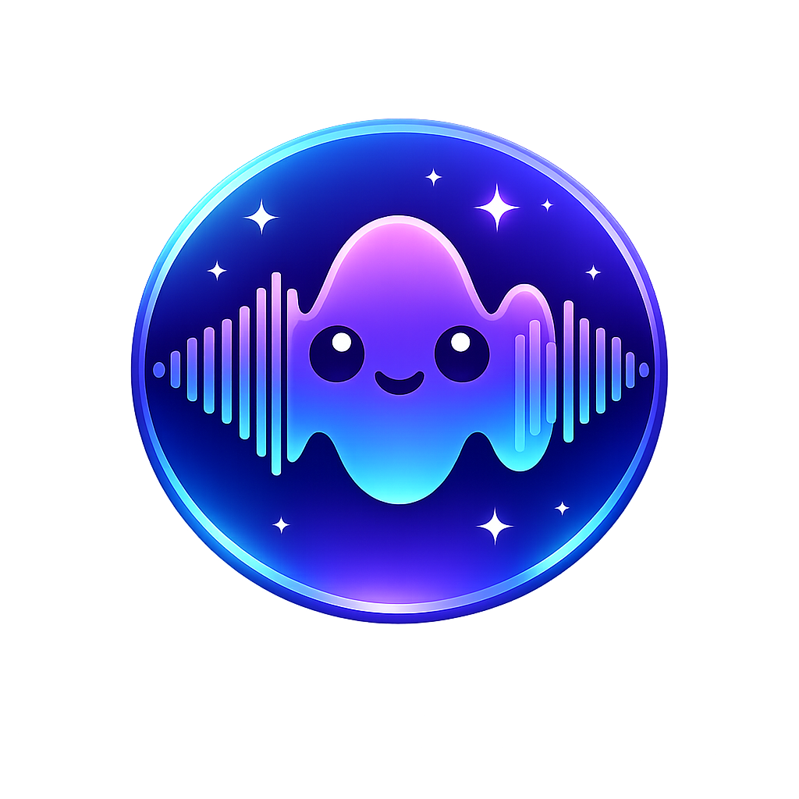
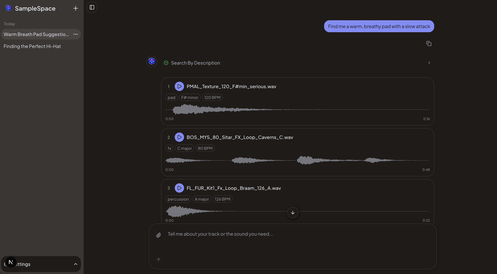
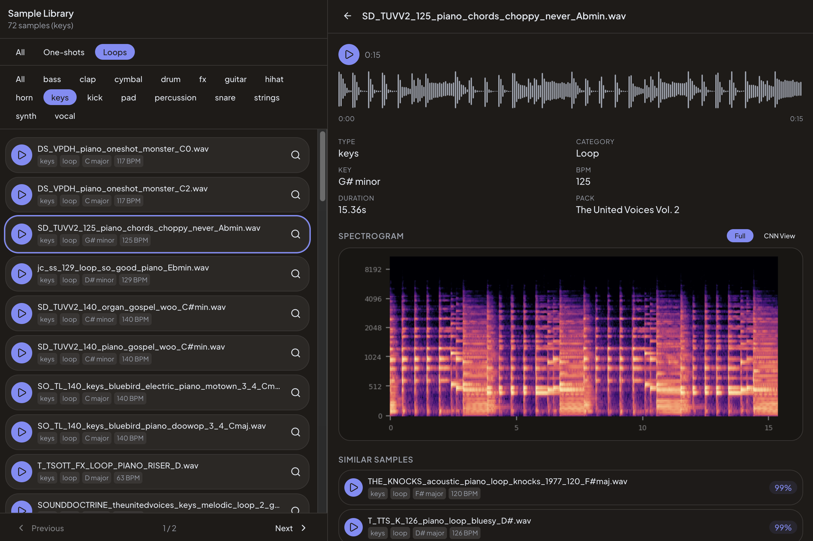
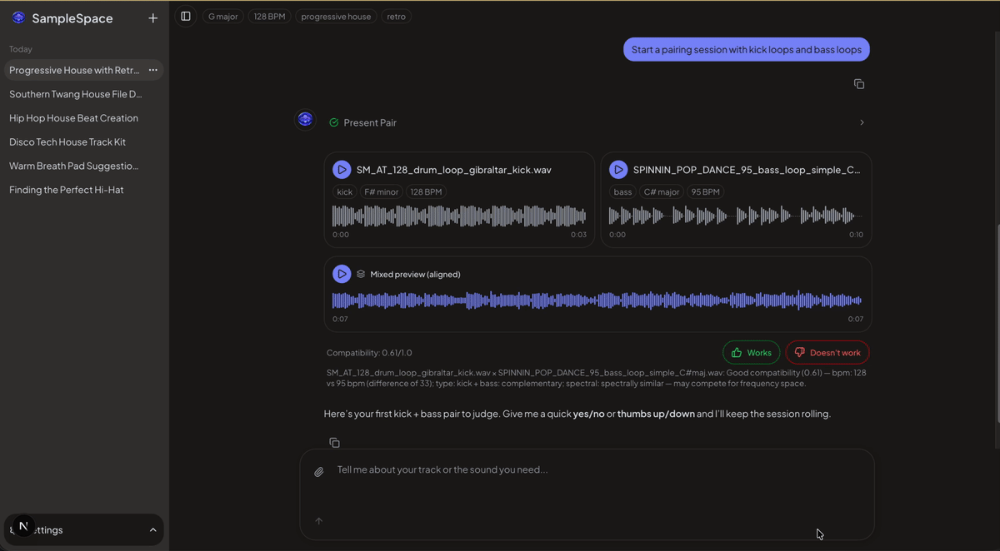

<div align="center">
  
  <h1>SampleSpace</h1>
  <p>An AI-powered music production assistant that actually understands your song. Describe the sound in your head, drop in a reference track, or just say what's missing — SampleSpace searches your
  entire library and finds what fits.</p>

  [](https://github.com/LukeMainwaring/samplespace/actions/workflows/ci.yml)
</div>

<div align="center">
  
</div>

## Why SampleSpace?

Music producers spend hours browsing sample libraries by folder name and filename. SampleSpace makes your entire library searchable by description, sound, and musical context — then learns your taste from feedback to get better over time.

## Features

- **Natural language search** — Search by description ("dark gritty kick", "airy vocal chop") — text-to-audio AI maps your words to matching sounds
- **Audio-to-audio similarity** — A custom-trained neural network finds spectrally similar samples
- **Agentic orchestration** — An AI agent decides which tools to call per query, enabling multi-step reasoning (analyze sample → check key compatibility → search for complement)
- **Song context** — Persistent per-thread key/BPM/genre/vibe that enriches searches and survives page refreshes
- **Pair feedback + preference learning** — Side-by-side sample evaluation with mixed audio preview, thumbs up/down verdicts, and a model that learns your pairing taste over time
- **Kit builder** — Automatically assembles multi-sample kits (kick + snare + hihat + bass + pad) with compatibility scoring and diversity penalties
- **Sample upload** — Upload reference tracks with auto-detected key/BPM/loop classification, then find similar library samples via audio-to-audio search
- **Audio transforms** — Pitch-shift and time-stretch for "Play Together" mixed previews aligned to song context

## Demo Workflows

These prompts showcase what SampleSpace can do that browsing folders can't.

### Context-aware search
> "I'm making a dark techno track in D minor at 130 BPM — find me a warm, breathy pad with a slow attack"

<div align="center">
  
</div>

Sets song context, then searches with CLAP embeddings enriched by the vibe. All subsequent searches inherit the context.

### Sample detail view
<div align="center">
  
</div>

Sample detail panel with full metadata, interactive waveform, mel spectrogram, and samples ranked by similarity percentage.

### Preview samples with reference track
> "Find my southern twang house upload and a bass loop that goes well with this reference track"
> ...
> "Preview bass loop #6 with my reference track"

<div align="center">
  
</div>

Upload your own music, set the song context from it, find complementary samples, and preview them together.

### Preference-driven pairing
> "Start a pairing session with kick loops and bass loops"

<div align="center">
  
</div>

Rapid-fire pair evaluation with random anchors. After 15+ verdicts, the preference model influences candidate selection and the agent explains what it's learned about your taste.

### Why CLAP + CNN + Agent?

- **CLAP** (pretrained): Bridges human language to audio content. "Warm analog pad" maps to the right spectral characteristics without any training.
- **CNN** (custom-trained): Learns spectral features specific to this sample library. Audio-to-audio similarity that CLAP can't do well.
- **Agent**: Orchestrates both modalities + metadata filtering. A query like _"find a lead that goes well with this bass"_ triggers CNN similarity, key compatibility filtering, then CLAP ranking.

## Quick Start

### Prerequisites

- [Docker](https://docs.docker.com/get-docker/) (for PostgreSQL + pgvector)
- [uv](https://docs.astral.sh/uv/) (Python package manager)
- [pnpm](https://pnpm.io/) (Node package manager)
- [Node.js](https://nodejs.org/) 20+
- [Rubber Band](https://breakfastquay.com/rubberband/) (`brew install rubberband` on macOS, `apt install rubberband-cli` on Linux)
- OpenAI API key

### Setup

```bash
# Clone and configure
git clone https://github.com/LukeMainwaring/samplespace.git
cd samplespace
cp .env.sample .env
# Edit .env with your OPENAI_API_KEY and SAMPLE_LIBRARY_DIR

# Start PostgreSQL + backend
docker compose up -d

# Backend setup
uv sync --directory backend
uv run --directory backend pre-commit install

# Seed and embed samples
uv run --directory backend seed-samples
uv run --directory backend embed-samples    # CLAP embeddings (~2 min)

# Train CNN (optional)
uv run --directory backend train-cnn
uv run --directory backend embed-cnn        # CNN embeddings (after training)

# Frontend setup
pnpm -C frontend install
pnpm -C frontend generate-client
pnpm -C frontend dev

# Visit http://localhost:3002
```

## Tech Stack

| Layer | Technology |
|-------|-----------|
| Frontend | Next.js 16, Tailwind CSS, shadcn/ui, TanStack Query |
| Chat UI | Vercel AI SDK (`useChat`), Streamdown |
| Backend | FastAPI, Pydantic v2, async SQLAlchemy |
| Agent | Pydantic AI with OpenAI |
| ML | PyTorch, torchaudio (CNN), HuggingFace transformers (CLAP), scikit-learn (preference model) |
| Embeddings | CLAP (`laion/clap-htsat-unfused`) 512-dim, Custom CNN 128-dim |
| Database | PostgreSQL + pgvector |
| Audio | librosa (key/BPM detection), music21, [Rubber Band](https://breakfastquay.com/rubberband/) R3 (pitch-shift/time-stretch) |
| DevOps | Docker Compose, GitHub Actions CI |
| Code Quality | Ruff, mypy (strict), pre-commit, Biome/Ultracite |

## Development

See [DEVELOPMENT.md](DEVELOPMENT.md) for testing, linting, migrations, and API client generation.

## Roadmap

See [docs/ROADMAP.md](docs/ROADMAP.md) for planned features including active learning, preference-aware recommendations, and confidence-gated automation.
