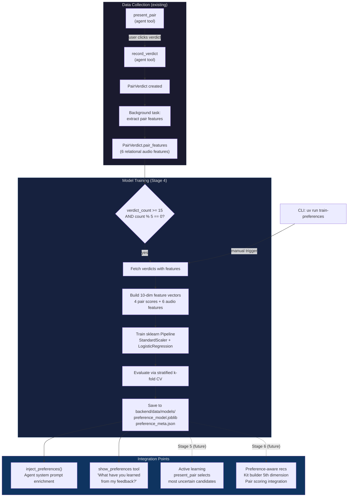

# Preference Learning Flow

Data flow diagram for SampleSpace's preference learning system — from verdict collection through model training to agent integration.

## Feature Vector (10 dimensions)

| # | Feature | Source | Range | Description |
|---|---------|--------|-------|-------------|
| 1 | key_score | pair_score_detail | [0, 1] | Key compatibility (circle of fifths) |
| 2 | bpm_score | pair_score_detail | [0, 1] | BPM compatibility (normalized) |
| 3 | type_score | pair_score_detail | [0, 1] | Type complementarity matrix |
| 4 | spectral_score | pair_score_detail | [0, 1] | CNN spectral distance/similarity |
| 5 | spectral_overlap | pair_features | [0, 1] | Frequency spectrum IoU |
| 6 | onset_alignment | pair_features | [0, 1] | Onset cross-correlation |
| 7 | timbral_contrast | pair_features | [0, 1] | MFCC cosine distance |
| 8 | harmonic_consonance | pair_features | [0, 1] | Chroma correlation |
| 9 | spectral_centroid_gap | pair_features | [0, 1] | Normalized centroid difference |
| 10 | rms_energy_ratio | pair_features | [0, 1] | Normalized log energy ratio |

Missing pair scores (e.g., key/BPM for one-shots) are imputed as 0.5 (neutral midpoint).
